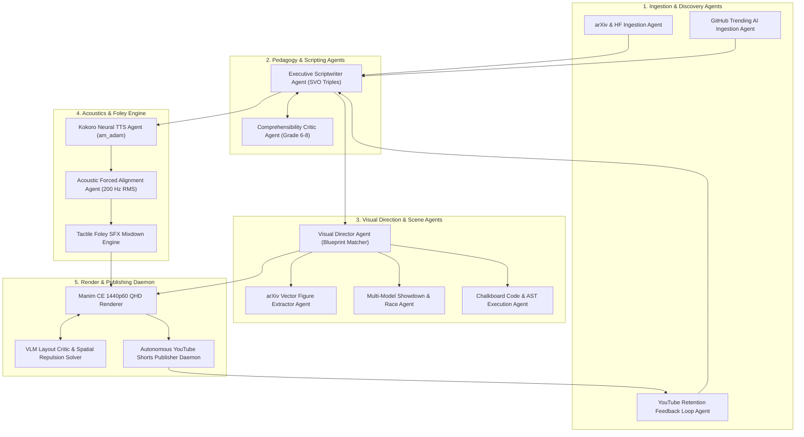

# 🤖 AGENTS.md — Autonomous Agent Operating Manual
## The Model Verse Autonomous Video Production Engine

> **Target Audience:** Autonomous AI coding agents, background daemons, subagents, and human contributors.  
> **Repository:** `Automated-video-Generation` (The Model Verse)  
> **Master Architecture:** Refer to [`ARCHITECTURE.md`](ARCHITECTURE.md) for full pipeline specs.  
> **Version History:** Refer to [`CHANGELOG.md`](CHANGELOG.md) for incremental release milestones.  
> **Contributing Guide:** Refer to [`CONTRIBUTING.md`](CONTRIBUTING.md) for style and PR guidelines.

---

## 1. Project Mission & Identity

**The Model Verse** is a fully autonomous broadcast engine that transforms frontier artificial intelligence, machine learning, and systems research papers (arXiv, Hugging Face) and viral open-source repositories (GitHub) into viral, pedagogically rigorous **3Blue1Brown-style vertical explainer videos (9:16)** for YouTube Shorts, Instagram Reels, and TikTok.

Every video produced by this system must meet the **Grant Sanderson Standard**:
- **Living Chalkboard Canvas:** Pure carbon background (`#0A0D14`) with subtle coordinate dot grids (`#2D3748`).
- **Computer Modern $\mathrm{\LaTeX}$ Formulas:** Rendered via native vector paths (`SVGMobject` / `MathTex`) with color-coded term annotations.
- **Physical & Algorithmic Geometry:** Every abstract algorithmic concept is embodied by tangible physical analogies (e.g., fluid streamlines, optical refraction prisms, virtual memory page tables, robotic kinematics).
- **Zero SaaS Slop:** Strictly banned: bullet-point cards, floating white boxes, robotic monotone audio, and disconnected stock video clips.

---

## 2. Multi-Agent Ecosystem Architecture

The production pipeline operates as a coordinated hierarchy of specialized autonomous agents:



### Agent Roles & Responsibilities

| Agent Role | Primary Module | Core Functionality |
| :--- | :--- | :--- |
| **Discovery Agent** | `pipeline/batch_digest.py`<br>`pipeline/github_trending_fetcher.py` | Ingests top trending research from arXiv, Hugging Face, and viral GitHub repos (vLLM, SGLang, BitNet, DeepSeek). Filters by viral velocity. |
| **Analytics Feedback Agent** | `pipeline/analytics_feedback.py` | Queries real-time YouTube Data API retention statistics. Applies dynamic multiplier biases (e.g., `hardware_efficiency: 1.44x`) and optimizes TTS speed. |
| **Scriptwriter Agent** | `pipeline/script_generator.py` | Generates 6-beat scripts with strict Subject-Verb-Object (`svo_action`) semantic triples, everyday physical analogies, and formula bindings. |
| **Pedagogy Critic Agent** | `pipeline/script_critic.py` | Evaluates reading level (Grade 6.0–8.0), Flesch reading ease (>65), jargon density, and analogy presence. Triggers autonomous rewrites if criteria fail. |
| **Visual Director Agent** | `pipeline/visual_director.py` | Assigns bespoke composable Manim blueprints for each beat. Eliminates repetitive templates and ensures visual diversity across beats. |
| **Vector Figure Agent** | `pipeline/arxiv_vector_extractor.py` | Extracts native vector figures from arXiv e-print `.tar.gz` packages and recolors them for dark chalkboard rendering. |
| **Showdown & Race Agent** | `pipeline/benchmark_extractor.py`<br>`manim_engine/primitives/showdown_engine.py` | Parses LaTeX benchmark tables into animated Horizontal Drag-Race Bars and 5-axis Spider/Radar Pareto Frontier plots. |
| **Code Execution Agent** | `manim_engine/primitives/code_execution_engine.py` | Renders macOS window chrome, multi-language tokenized code, glowing line scanners, and real-time GPU register monitors. |
| **Acoustic Aligner Agent** | `pipeline/aligner.py` | Computes 200 Hz energy envelopes, snaps word boundaries to acoustic dips, and enforces the **Frame-Ahead Rule** (-33ms to -66ms). |
| **Tactile Foley Agent** | `pipeline/audio_synthesizer.py` | Automatically layers tactile zero-license micro-SFX (whooshes, clicks, pings, sub-bass drops) aligned to exact Manim visual animation triggers. |
| **VLM Layout Critic Agent** | `pipeline/vlm_critic.py`<br>`pipeline/geometric_layout_solver.py` | Inspects headless rendered keyframes, detects mobject collisions, and applies deterministic spatial repulsion nudges. |
| **Daily Shorts Daemon** | `pipeline/daily_shorts_daemon.py` | Background daemon orchestrating end-to-end production across 5 research-backed pre-peak upload windows. |

---

## 3. Inviolable Design & Quality Rules

All autonomous agents modifying code or generating animations in this repository **must strictly enforce these rules**:

### Rule 1: Zero "SaaS Card" / Bullet-Point Presentations
- **BANNED**: Rendering floating opaque cards with 3–4 bullet points of static text.
- **MANDATORY**: Animate the **actual physical, geometric, or algorithmic mechanism**.
  - If explaining KV cache $\to$ animate token matrix allocations, paged memory virtual blocks, or prefix tree matching.
  - If explaining diffusion $\to$ animate continuous vector flow field streamlines guiding particles from noise to image manifold.
  - If explaining reasoning $\to$ animate search trees expanding, scoring, and pruning dead-end branches.

### Rule 2: Auditory-Visual Complementarity (Zero Text Mirroring)
- The voiceover audio carries **narrative intuition, motivation, and conceptual clarity**.
- The visual canvas carries **geometry, topology, transformations, and system state**.
- On-screen text is strictly limited to:
  1. Top branding watermark: `THE MODEL VERSE // DOMAIN`.
  2. Topic & Beat Title pills: `RADIX CACHING IN SGLANG`.
  3. Mathematical formulas and variables ($\mathrm{\LaTeX}$ via `MathTex`).
  4. State register pills: `[⚡ RADIX HIT: +2,048 TOKENS REUSED]`.
  5. Kinetic subtitle pills positioned parafoveally at $y = -3.45$.

### Rule 3: Mobile 9:16 Vertical Safe Zones
Standard Manim 16:9 widescreen coordinates do **not** apply. In our 9:16 vertical canvas (`frame_width = 9.0`, `frame_height = 16.0`):
- **World Coordinate Boundaries:** $X \in [-4.5, 4.5]$, $Y \in [-8.0, 8.0]$.
- **The Sacred Hero Zone:** All visual compositions, code blocks, and diagrams must be centered within:
  $$X \in [-3.6, 3.6] \quad \text{and} \quad Y \in [-2.4, 5.5]$$
- **Subtitle Safe Zone:** Kinetic subtitle pills are rendered at $y = -3.45$ (height $\approx 0.72$). All visual compositions must maintain a **safety buffer $\ge 0.95$ units** above $y = -3.45$ (i.e., bottom edge of visual mobjects must stay $\ge -2.40$).
- **Top Bar Safe Zone:** Platform headers (stories/reels UI) occupy $y > 6.2$. The brand watermark is pinned at $y = 7.10$.

### Rule 4: The Frame-Ahead Synchronization Rule
- Human visual perception registers motion ~30–50ms faster than auditory phoneme processing.
- All visual transformations (e.g., branch pruning, highlight sweeps, radar expansions) must trigger **33ms to 66ms (1 to 2 frames) before the spoken onset of the corresponding verb or key noun**:
  $$t_{\text{trigger}} = \max(0, t_{\text{word\_start}} - 0.04\text{s})$$

### Rule 5: Modern Manim Community Edition (CE v0.19+) Conventions
- Use `Create(mob)` instead of legacy `ShowCreation(mob)`.
- Use `mob.animate.method()` instead of `ApplyMethod`.
- Use `FadeIn(mob, shift=...)` / `FadeOut(mob, shift=...)` instead of `FadeInFrom`.
- Use `Axes.plot(...)` instead of legacy graph functions.
- Never use `CONFIG = {...}` dictionaries; use standard Python `__init__(self, **kwargs)` with `super().__init__(**kwargs)`.
- Inherit from `BaseBlueprintComposition` or `VGroup`, add children to `self.content_group`, and register kinetic mobjects into `self.kinetic_elements`.

---

## 4. Testing & Verification Requirements

Before submitting changes or opening pull requests:
1. **Targeted Unit Tests:**
   ```bash
   pytest test/test_github_trending_fetcher.py test/test_code_execution_engine.py -v
   ```
2. **Headless Visual Render Verification:**
   ```bash
   manim -ql -s -r 540,960 --fps 15 test/test_code_execution_engine.py TestChalkboardCodeBlockScene
   ```
3. **Full Regression Test Suite (Zero Failures):**
   ```bash
   pytest
   ```
4. **Git Protocol:** Always branch from `main`, commit with clear semantic prefixes (`feat:`, `fix:`, `refactor:`, `docs:`), and raise a PR via `gh pr create`.

---

## 5. Quick CLI Reference

```bash
# Ingest mixed arXiv + GitHub trending breakthroughs and produce 1 short
python3 pipeline/daily_shorts_daemon.py --run-now --source mixed --count 1

# Produce a specific arXiv paper
python3 pipeline/daily_shorts_daemon.py --run-now --arxiv 2407.08608

# Ingest only GitHub trending AI repositories
python3 pipeline/daily_shorts_daemon.py --run-now --source github --count 1

# Dry-run paper discovery, script synthesis, and pedagogy audit without rendering
python3 pipeline/daily_shorts_daemon.py --dry-run --count 1

# Run the standing 5-slot pre-peak upload daemon in background
python3 pipeline/daily_shorts_daemon.py --daemon
```
