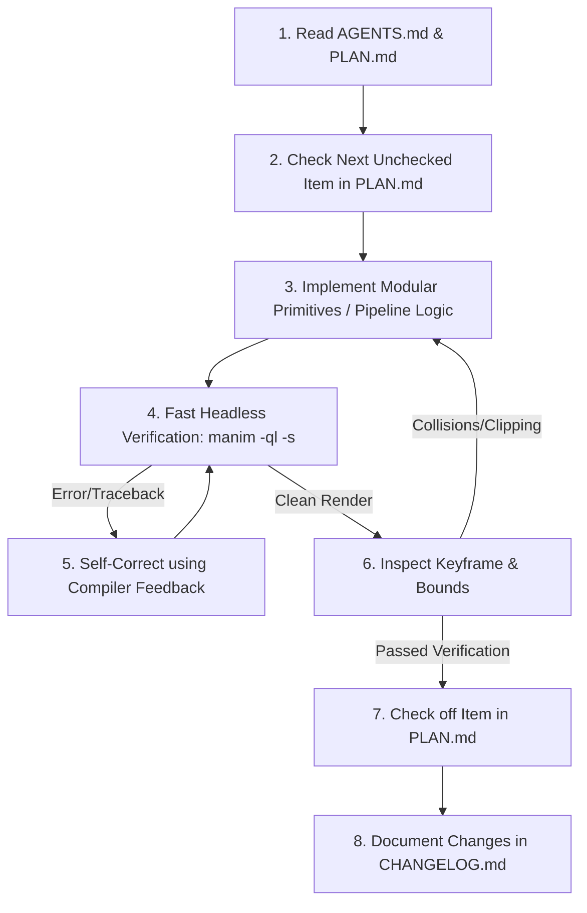

# AGENTS.md — Autonomous Agent Operating Manual
## The Model Verse Shorts Engineering Protocol

> **Target Audience:** All AI coding agents, autonomous subagents, and human contributors working on this repository.  
> **Repository:** `/Users/amankumar/Aman/Test-WOrkspace/themodelverse-shorts`  
> **Master Plan:** Refer to [`PLAN.md`](PLAN.md) for current phase objectives, task breakdowns, and milestones.  
> **Version Tracking:** Record all meaningful updates and fixes in [`CHANGELOG.md`](CHANGELOG.md).  

---

## 1. Core Mission & Project Identity

**The Model Verse Shorts** is an autonomous production engine that converts cutting-edge artificial intelligence, robotics, and computer science research papers (primarily from arXiv) into viral, pedagogically rigorous **3Blue1Brown-style vertical explainer videos (9:16)** for YouTube Shorts, Instagram Reels, and TikTok.

---

## 2. Inviolable Design & Quality Constraints

Every agent modifying code or generating animations in this repository **must strictly adhere to these rules**:

### Rule 1: Zero "SaaS Card" / Bullet-Point Presentations
- **BANNED**: Rendering opaque rectangular cards (`create_tech_card`) containing 3–4 bullet points of static text.
- **MANDATORY**: Animate the **actual physical, geometric, or algorithmic mechanism**.
  - If the paper discusses tree search $\to$ animate an actual expanding `TreeGraph` with glowing frontiers and severed pruned subtrees.
  - If the paper discusses robotics kinematics $\to$ animate forward kinematics with capsule hulls, joint limits, and obstacle contact shockwaves.
  - If the paper discusses Sparse Autoencoders (SAEs) $\to$ animate high-dimensional vector superposition, overcomplete starburst dictionaries, and top-$k$ sparsity sieves.

### Rule 2: Auditory-Visual Complementarity (Zero Verbatim Text)
- The voiceover audio carries **narrative intuition, motivation, and conceptual flow**.
- The on-screen visual carries **geometry, topology, transformations, and spatial state**.
- On-screen text is strictly reserved for:
  1. High-contrast topic and beat badges (e.g. `THE MODEL VERSE // MECHANISM`).
  2. Mathematical formulas and variables ($\mathrm{\LaTeX}$ via `MathTex` / pre-compiled vector SVGs).
  3. Discrete entity state chips (e.g. `[q_coll: INFEASIBLE]`, `[Top-K: 2/8]`).
  4. Dynamic, 2-to-3 word kinetic subtitle chunks placed parafoveally below the hero visual.

### Rule 3: Mobile 9:16 Vertical Safe Zones
Default Manim 16:9 canvas coordinates ($[-7.11, 7.11] \times [-4.0, 4.0]$) do **not** apply.  
In our 9:16 vertical setup (`config.frame_width = 9.0`, `config.frame_height = 16.0`):
- **World Coordinate Boundaries**: $X \in [-4.5, 4.5]$, $Y \in [-8.0, 8.0]$.
- **The Sacred Central Canvas**: All critical diagrams, text, and math **must remain strictly within**:
  $$X \in [-3.2, 3.2] \quad \text{and} \quad Y \in [-5.5, 5.5]$$
  *(Pixels: $Y \in [480\text{px}, 1180\text{px}]$, $X \in [80\text{px}, 900\text{px}]$)*.
- Never place formulas or core diagrams in the top 240px (platform header) or bottom 540px (account handle, title, seekbar).

### Rule 4: The Frame-Ahead Synchronization Rule
- Human visual cognition registers motion ~30–50ms faster than auditory phoneme processing.
- All visual transformations (e.g. branch pruning, router firing, token morphing) must be scheduled **33ms to 66ms (1 to 2 frames) before the spoken onset of the corresponding verb**.

### Rule 5: Modern Manim Community Edition (CE v0.19+) Syntax
Agents must never use legacy Cairo or ManimGL APIs.
- Use `Create(mob)` instead of `ShowCreation(mob)`.
- Use `Axes.plot(...)` instead of `Axes.get_graph(...)`.
- Use `mob.animate.method()` instead of `ApplyMethod`.
- Use `FadeIn(mob, shift=...)` / `FadeOut(mob, shift=...)` instead of `FadeInFrom` / `FadeOutAndShift`.
- Never use `CONFIG = {...}` dictionaries; use standard Python `__init__(self, **kwargs)` with `super().__init__(**kwargs)`.
- For modular mobjects, inherit from `VGroup`, register children via `self.add()`, and expose semantic attributes rather than hardcoded indexing.

### Rule 6: Closed-Loop Actor-Critic & Layout Auto-Repair Governance
When repairing visual flaws or responding to VLM critic audits:
- **Never Regenerate the Whole Scene AST**: Full-code re-synthesis introduces high entropy, catastrophic drift, and syntax breaks.
- **Use Typed Layout Parameter Patches**: Apply deterministic layout offsets $(\Delta x, \Delta y)$, scale multipliers $s \in [0.65, 1.0]$, and vertical shifts via `pipeline/layout_solver.py` and `StoryboardLayoutPatch`.
- **Enforce Deterministic Convergence**: Max 2 repair iterations per beat. If an adjustment lowers the composite audit score, roll back immediately to the previous best candidate.


---

## 3. Workflow for Agents: How to Work on This Codebase

When picked up by an autonomous agent, follow this exact protocol:



### Step 1: Check Current Objective
Consult [`PLAN.md`](PLAN.md) to see which phase and task is currently in progress. Do not invent divergent architectures; build on the established 5-phase roadmap.

### Step 2: Implement or Refactor
- Write modular, cleanly typed Python code.
- Place all reusable visual components in `manim_engine/primitives/<domain>/`.
- Avoid hardcoding model names or specific paper values inside scene classes.

### Step 3: Fast Headless Verification (Do Not Render Full HD Blindly!)
Before running a slow 60-second high-resolution render, test the scene instantaneously:
```bash
# Render only the final still frame at draft quality (takes ~1-2 seconds)
manim -ql -s --media_dir test_media path/to/scene_file.py SceneClassName
```
Inspect the output image to ensure:
1. Zero Python tracebacks.
2. Zero text overlaps or collisions.
3. Perfect adherence to the 9:16 safe-zone bounding box ($X \in [-3.2, 3.2]$, $Y \in [-5.5, 5.5]$).

### Step 4: Update Documentation
Upon successful verification:
1. Check off the completed milestone/task checkbox in [`PLAN.md`](PLAN.md).
2. Add a clear, concise entry under the appropriate version header in [`CHANGELOG.md`](CHANGELOG.md).

---

## 4. Visual Primitives & Taxonomy Reference

Agents should leverage the tested primitive architectures developed during the 10-agent research phase:

| Domain | Target Primitives | Key File Location |
| :--- | :--- | :--- |
| **Robotics & Planning** | `CoupledStateSpace`, `ConstraintProjectionSheaf`, `ParametricKinematicArm`, `ASTMorphTree`, `SandboxIsolationPod` | `manim_engine/primitives/robotics/` |
| **Deep Learning & SAE** | `SAEConstellation`, `TransformerAttentionGrid`, `SparseMoELattice`, `ContrastiveHypersphere` | `manim_engine/primitives/neural/` |
| **Search & Algorithms** | `DynamicSearchTree`, `BranchAndBoundLaser`, `MCTSCycle` | `manim_engine/primitives/search/` |
| **Metrics & Performance** | `DynamicLeaderboard`, `DualMetricGauge`, `DistributionCurve` | `manim_engine/primitives/metrics/` |

---

## 5. Environment & Hardware Specifications

- **OS / Platform**: macOS (Apple Silicon M-series).
- **Python**: 3.12 (managed via pyenv at `/Users/amankumar/.pyenv/versions/3.12.2/bin/python3`).
- **Rendering Engine**: Manim Community Edition v0.21.0 (Cairo renderer optimized for Apple Silicon P-cores).
- **TTS Engine**: Kokoro-82M ONNX neural TTS (`am_adam`, `am_michael`).
- **Video Assembly**: Native PyAV bindings + FFmpeg with libx264 and aac.
- **LLM Access**: Google Gemini API with automatic model cascade fallback (`gemini-3.1-flash-lite`, `gemini-3.5-flash-lite`, `gemma-4-31b-it`).
