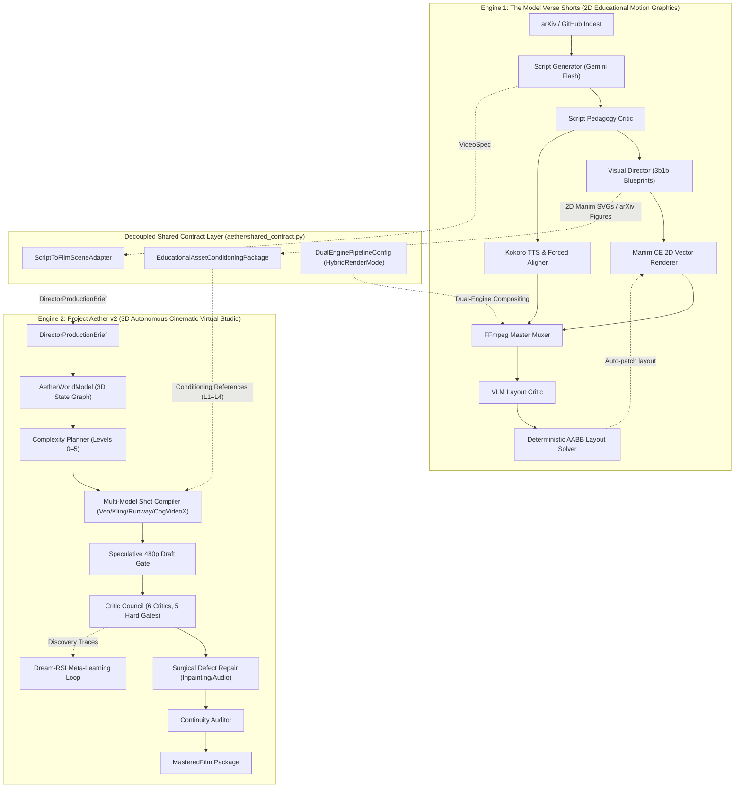

# 🏛️ ARCHITECTURE.md — The Model Verse & Project Aether System Architecture

> **The Model Verse Dual-Engine Autonomous Production Platform**  
> Comprehensive architectural specification for 2D programmatic Manim explainers and 3D autonomous cinematic generative virtual studio production.

---

## 1. Executive Architecture Overview

The Model Verse repository houses two distinct, high-capability video generation engines that operate independently while communicating through a clean, decoupled shared contract layer:



### Architectural Comparison Matrix

| Architectural Dimension | The Model Verse Shorts Engine (`pipeline/` + `manim_engine/`) | Project Aether (`aether/`) |
| :--- | :--- | :--- |
| **Engine Paradigm** | 2D Mathematical & Algorithmic Motion Graphics | 3D Generative Cinematic Virtual Studio |
| **Primary Output** | 9:16 Vertical Explainer Shorts (1440p60 QHD) | Multi-Shot Cinematic Films & Dramatic Sequences |
| **Rendering Engine** | Deterministic Manim CE (v0.19+) via Cairo/FFmpeg | Generative Diffusion (Google Veo 3.1, Kling 3.0, Runway Gen-4.5, CogVideoX) |
| **World Representation** | 2D Declarative Canvas Scene Graph (`vsg_schema.py`) | 3D Persistent World Model (`aether.state.graph`, `aether.state.schemas`) |
| **Narrative Planning** | 6-Beat SVO Triples & 3b1b Blueprints (`visual_director.py`) | 6-Tier Complexity Budgeting (`aether.compiler.complexity`) |
| **Quality Verification** | Headless Keyframe VLM Critic (`vlm_critic.py`) | 6-Critic Council with 5 Binary Hard Gates (`aether.council`) |
| **Auto-Repair Engine** | Deterministic AABB Spatial Repulsion (`layout_solver.py`) | Spatio-Temporal Inpainting & Audio Remastering (`aether.repair`) |
| **Self-Improvement** | Real-Time YouTube Audience Retention (`analytics_feedback.py`) | Offline Dream-RSI Policy Simulation (`aether.teacher`) |
| **Execution Entrypoint** | `python3 pipeline/run_pipeline.py --arxiv <id>` | `python3 -m aether.director --brief "<premise>"` |
| **Operational State** | **Active Production Workhorse (Zero API Cost)** | **Standby / Simulation Readiness (Budget-Contingent)** |

> [!NOTE]
> **Operational Deployment & Compute Strategy**:
> - **The Model Verse Shorts Engine (`pipeline/` + `manim_engine/`)** is the active daily production system. It runs at zero API credit cost utilizing local/free Ollama Cloud models (`gpt-oss:120b:cloud`), Kokoro offline TTS, and deterministic Manim 2D chalkboard rendering.
> - **Project Aether (`aether/`)** is fully implemented and test-verified across all 6 pillars (394+ passing tests). It is currently held in Standby / Simulation Readiness mode, and will be activated for live generative video rendering once dedicated commercial video API credits (Google Veo 3.1, Kling 3.0, Runway Gen-4.5) and cloud GPU clusters (ComfyUI / CogVideoX / HunyuanVideo) are funded.

---

## 2. Engine 1: The Model Verse Shorts Pipeline (`pipeline/` + `manim_engine/`)

The Model Verse converts cutting-edge research publications (arXiv, Hugging Face) and open-source AI kernels (GitHub Trending) into broadcast-grade 3Blue1Brown vertical shorts (9:16 at 1440p60 QHD) through a 7-stage autonomous pipeline:

### Stage 1: Discovery & Ingestion
- **arXiv & Hugging Face (`pipeline/batch_digest.py`, `pipeline/arxiv_fetcher.py`)**: Fetches daily trending papers, cleans LaTeX abstracts, extracts publication metadata, and queries e-print source bundles.
- **Native Paper Figure Extraction (`pipeline/arxiv_vector_extractor.py`)**: Downloads LaTeX source tarballs, parses PDF/EPS vector graphics, generates 350 DPI unsharp-masked rasters, and extracts SVGs for chalkboard aesthetics.
- **GitHub Trending AI (`pipeline/github_trending_fetcher.py`)**: Scans viral repositories (`topic:llm`, `topic:cuda`, `stars:>1000`) and extracts core execution kernels (e.g. RadixAttention, PagedAttention, BitNet ternary GEMM).
- **Audience Velocity Calibration (`pipeline/analytics_feedback.py`)**: Multiplies candidate discovery scores by real-time YouTube audience retention velocity (e.g., `hardware_efficiency: 1.44x`, `multimodal_diffusion: 1.29x`).

### Stage 2: Pedagogy & Script Synthesis
- **Structured Script Specification (`pipeline/script_generator.py`)**: Prompts Gemini 2.5 Flash to synthesize a 6-beat voiceover script adhering to strict Subject-Verb-Object (`svo_action`) semantic triples, everyday physical analogies (sculptor, cloud, mirror, filing cabinet), and exact mathematical formula bindings.
- **Pedagogy Critic Gate (`pipeline/script_critic.py`)**: Autonomously audits the generated script against Flesch-Kincaid Grade Level ($\le 8.0$), reading ease ($\ge 65$), and anti-jargon constraints with autonomous rewriting.

### Stage 3: Visual Direction & Blueprint Assignment
- **Visual Director (`pipeline/visual_director.py`)**: Analyzes spoken narrative and analogies to assign bespoke visual blueprints:
  - **Narrative Blueprints (`manim_engine/primitives/visual_compositions.py`)**: Pipeline stages, split flows, catalog routing, camera projective geometry, barrier isolation, decision trees, layer stacks, convergence funnels.
  - **Physics Simulations (`manim_engine/primitives/physics_simulations.py`)**: Vector flow fields, synaptic activation waves, attention prism optical refractions, 2.5D loss landscape gradient descents.
  - **Authentic arXiv Figures (`pipeline/arxiv_vector_extractor.py`)**: Vector and raster figure display dynamically bound to Beat 3 (`paper_figure` blueprint).
  - **Multi-Model Showdown (`manim_engine/primitives/showdown_engine.py`)**: Animated Horizontal Drag-Race Bars and 5-axis Spider/Radar Pareto Frontier plots.
  - **Chalkboard Code Execution (`manim_engine/primitives/code_execution_engine.py`)**: macOS window chrome, syntax tokenization (Python, CUDA, C++), active line scanning, and live GPU register monitors.

### Stage 4: Neural Acoustics & Tactile Foley Engine
- **Neural Speech (`pipeline/audio_synthesizer.py`)**: Kokoro-82M ONNX model (`am_adam` voice) rendered with dynamic pacing (1.12x speedup calibrated to YouTube retention).
- **Acoustic Forced Alignment (`pipeline/aligner.py`)**: 200 Hz (5ms hop) Savitzky-Golay smoothed RMS energy envelope tracking that snaps word boundaries to acoustic dips with $\pm 75\text{ms}$ precision. Enforces the **Frame-Ahead Rule** (-33ms to -66ms) so animation motion leads auditory perception.
- **Tactile Foley SFX Mixdown (`public/sfx/`)**: Procedural layering of sub-bass impacts, laser sweeps, camera whooshes, mechanical clicks, and glass chimes at exact millisecond animation triggers.

### Stage 5: Manim CE Vector Rendering
- **Broadcast Render Specs**: $1440 \times 2560$ (2K QHD Vertical) or $1080 \times 1920$ (FHD Vertical) at 60 FPS, 9:16 aspect ratio.
- **Color Palette**: 3Blue1Brown Carbon Chalkboard (`#0A0D14`), Neon Cyan (`#38BDF8`), Mint Green (`#10B981`), Amber (`#F59E0B`), Coral (`#EF4444`), Violet (`#C084FC`).
- **Continuous Micro-Motion**: Uses Manim updaters (`add_updater`, `ValueTracker`) to guarantee zero static dead frames.

### Stage 6: Closed-Loop Visual Repair
- **VLM Keyframe Audit (`pipeline/vlm_critic.py`)**: Headless keyframes analyzed by Gemini Vision to detect overlaps or off-screen elements.
- **Deterministic Geometric Layout Solver (`pipeline/layout_solver.py`)**: Converts VLM bounding boxes into coordinate adjustments and applies spatial repulsion forces to resolve collisions deterministically.

### Stage 7: Broadcast & Autonomous Upload
- **High-CTR Thumbnails (`pipeline/thumbnail_generator.py`)**: Renders high-contrast visual hooks with glowing hero geometry and bold uppercase typography.
- **YouTube Shorts API (`pipeline/publisher.py`)**: Uploads via OAuth2 with optimized technical tags, SEO description, and audience engagement metadata.
- **Standing Daily Daemon (`pipeline/daily_shorts_daemon.py`)**: Autonomous 5-slot daily cron daemon (01:00, 05:00, 09:00, 12:00, 16:00 UTC).

---

## 3. Engine 2: Project Aether v2 (`aether/`)

Project Aether is an autonomous, multi-shot 3D cinematic generative virtual studio (v0.2.0, WBS 1.1–1.11) designed to translate narrative briefs into multi-model generative films while maintaining strict spatial and physical consistency across cuts.

### Pillar 1: Master Autonomous Director Orchestrator (`aether/director/`)
- **Central Coordinator (`aether/director/orchestrator.py`)**: Coordinates narrative decomposition, world setup, shot compilation, speculative draft gating, council audits, surgical defect repair, and final mastering.
- **Production Briefs & Schemas (`aether/director/schemas.py`)**: Defines `DirectorProductionBrief`, `FilmScene`, `ShotTimelineRecord`, `MasteredFilm`, and `ProductionState` lifecycle states.
- **CLI & Module Entrypoints (`aether/director/cli.py`, `aether/director/__main__.py`)**: Exposes `--brief`, `--duration`, `--models`, `--budget`, `--dry-run`, and `--speculative-draft` commands.

### Pillar 2: Persistent 3D World State Graph (`aether/state/`)
- **AetherWorldModel (`aether/state/graph.py`)**: Persistent 3D world state engine maintaining characters, prop rosters, lighting, weather, and camera kinematics across sequential shots with branching and rollbacks.
- **State Schemas (`aether/state/schemas.py`)**: Pydantic models for `CharacterState`, `PropState`, `WardrobeItemState`, `CameraState`, `HandAttachment`, and `SceneSnapshot`.
- **Continuity Auditor (`aether/state/continuity.py`)**: Rigorous multi-shot continuity auditor checking physical velocity thresholds, prop conservation across handoffs, wardrobe damage progression, and reciprocal eyeline angles across cuts.
- **State Ledger Store (`aether/state/store.py`)**: Persistent JSON store and time-travel query API for shot state histories.

### Pillar 3: Complexity Planning & Multi-Model Shot Compilation (`aether/compiler/`)
- **Complexity Planner (`aether/compiler/complexity.py`)**: Classifies shots into 6 discrete complexity tiers (Levels 0 to 5):
  - **Level 0 (Prompt-Only)**: Atmospheric cutaways, cloudscapes, vistas, and abstract concepts with no actor interaction.
  - **Level 1 (Reference Image)**: Static portraits and establishing frames anchored by photorealistic image conditioning.
  - **Level 2 (Keyframes Interpolation)**: Straightforward camera pans, zooms, and simple actions bounded by start and end keyframes.
  - **Level 3 (2D Trajectory & Pose)**: Talking heads, walking towards camera, and gestural dialogue requiring pose and lip-sync alignment.
  - **Level 4 (3D Geometric Blocking)**: Multi-character blocking, camera crane moves, and hand-object handoffs requiring 3D spatial previs.
  - **Level 5 (Full Physical Simulation)**: Complex physical collisions, fluid dynamics, grapples, and stunts requiring deterministic simulation.
- **Multi-Model Shot Compiler (`aether/compiler/compiler.py`)**: Compiles shot requirements into provider-specific generative payloads for Google Veo 3.1, Kling 3.0, Runway Gen-4.5, and open-weights CogVideoX (ComfyUI).
- **Compiler Schemas (`aether/compiler/schemas.py`)**: Pydantic schemas for `ComplexityLevel`, `ProviderTarget`, `ComputeTier`, `SpatialRepresentationPackage`, and `CompiledModelPayload`.

### Pillar 4: Speculative Draft Gating & Critic Council (`aether/council/`)
- **Speculative 480p Draft Gating**: Pre-screens candidate generations using low-latency 480p renders before committing compute to expensive 1080p latent upscaling.
- **Critic Council Aggregator (`aether/council/council.py`)**: Master voting engine aggregating 6 specialized domain critics and enforcing 5 binary hard quality gates.
- **Specialized Critics (`aether/council/critics.py`)**:
  1. *Visual & Anatomy Critic*: Detects morphological distortions, extra limbs, and texture swimming.
  2. *Temporal & Jitter Critic*: Evaluates frame-to-frame flow variance and edge flickering.
  3. *Continuity Critic*: Audits wardrobe damage, lighting direction, and prop possession across cuts.
  4. *Performance & Lip-Sync Critic*: Verifies phonetic mouth movement alignment with speech audio.
  5. *Physics & Collision Critic*: Flags unphysical floating, interpenetration, and momentum violations.
  6. *Audio & Foley Critic*: Checks sound stem mixing, voice clarity, and acoustic ambiance.
- **Deterministic CV Analyzer (`aether/council/cv_analyzer.py`)**: OpenCV temporal and optical flow variance analyzer measuring SSIM and motion vector entropy.
- **Council Schemas (`aether/council/schemas.py`)**: Models for `HardGateType`, `DefectSeverity`, `CriticFailureObject`, and `CouncilEvaluationReport`.

### Pillar 5: Spatio-Temporal Masking & Surgical Defect Repair Engine (`aether/repair/`)
- **Repair Planner (`aether/repair/planner.py`)**: Triage engine that maps critic failure objects into ranked, executable repair plans (`REGIONAL_TEMPORAL_INPAINTING`, `AUDIO_REMASTER`, `SPATIAL_PREVIS_REBLOCK`).
- **Protected Region Masking (`aether/repair/masking.py`)**: Generates spatio-temporal boundary masks protecting actor faces, stable background plates, and camera motion paths from inpainting corruption.
- **Repair Executor (`aether/repair/executor.py`)**: Dispatches localized latent diffusion inpainting, voice/foley audio remastering, or 3D previs reblocking to fix defective segments without re-rendering entire scenes.
- **Repair Schemas (`aether/repair/schemas.py`)**: Pydantic models for `RepairActionType`, `ProtectedRegion`, `RepairTask`, `RepairPlan`, and `RepairExecutionResult`.

### Pillar 6: Dream-RSI Meta-Learning Loop (`aether/teacher/`)
- **Episode Trace Logger (`aether/teacher/trace_logger.py`)**: Persists end-to-end production runs as immutable Directed Acyclic Graph (DAG) trace trees (`DiscoveryTraceTree`, `TraceNode`).
- **Offline Policy Dreamer (`aether/teacher/dreamer.py`)**: Implements Dream-RSI (Recursive Self-Improvement), discovering Pareto-optimal compilation policies by evaluating the objective:
  $$V_{im} = \max_v s_v - \beta_1 N_{im} + \beta_2 \frac{N_{im}}{\max(1, k^*_{im})}$$
  over historical replay pools without incurring live generative API costs.
- **Replay Simulator Pool (`aether/teacher/replay_simulator.py`)**: Simulates counterfactual compilation policies against recorded critic evaluations.

### Pillar 7: AetherBench Cinematic Benchmark Suite (`aether/bench/`)
- **Scenario Registry (`aether/bench/scenarios.py`, `aether/bench/registry.py`)**: Standardized suite of 30+ canonical cinematic stress tests (fluid simulations, stunt choreography, complex specular lighting, extreme camera velocities).
- **Synthetic Defect Injectors (`aether/bench/defects.py`)**: Controlled defect injectors to validate critic sensitivity and calibration.
- **Automated Runner (`aether/bench/runner.py`)**: Harness for scoring multi-model generation performance across standardized cinematic benchmarks.

---

## 4. Comprehensive File-by-File Comparative Audit

The following audit matrix compares all 38 files in Project Aether (`aether/`) against their operational counterparts and functional equivalents across The Model Verse Shorts engine (`pipeline/` + `manim_engine/`):

### Table 1: Master Orchestration & Entrypoints

| Module Category | Project Aether File | The Model Verse Shorts File | Architectural Comparison & Operational Divergence |
| :--- | :--- | :--- | :--- |
| **Director / Orchestrator** | `aether/director/orchestrator.py` (1,154 lines) | `pipeline/run_pipeline.py` (388 lines), `pipeline/auto_produce.py` (557 lines) | **Aether**: Assembles multi-shot 3D cinematic films via state graphs, complexity classification, multi-model compilation, speculative draft gating, council audits, and surgical repair.<br>**Shorts**: Linear 7-stage script-to-video producer coordinating TTS, forced alignment, Manim rendering, FFmpeg muxing, and YouTube upload. |
| **CLI & Entrypoints** | `aether/director/cli.py` (190 lines), `aether/director/__main__.py` (12 lines) | `pipeline/run_pipeline.py` (lines 247–388), `pipeline/daily_shorts_daemon.py` (420 lines) | **Aether**: Accepts premise or JSON brief, budget limits, target diffusion models, and executes dry-run simulation or real production.<br>**Shorts**: Accepts `--topic`, `--arxiv`, `--category`, `--voice`, `--lang`, `--quality`, and runs automated daily production daemon. |
| **Director Schemas** | `aether/director/schemas.py` (299 lines) | `pipeline/schemas.py` (35 lines), `pipeline/vsg_schema.py` (430 lines) | **Aether**: Defines `DirectorProductionBrief`, `FilmScene`, `ShotTimelineRecord`, `MasteredFilm`.<br>**Shorts**: Defines `VideoSpec`, `BeatSpec`, `SFXCue`, and declarative VSG entity/action primitives. |
| **Subsystem Bridge** | `aether/shared_contract.py` (420 lines) | `pipeline/aether_director.py` (122 lines) | **Aether**: Clean shared contract providing `ScriptToFilmSceneAdapter`, `EducationalAssetConditioningPackage`, and `HybridRenderMode`.<br>**Shorts**: Pipeline wrapper providing `AetherDirectorPipeline`, `produce_aether_film`, and CLI integration. |

---

### Table 2: World State Tracking vs 2D Canvas Scene Graph

| Subsystem Component | Project Aether File | The Model Verse Shorts File | Architectural Comparison & Operational Divergence |
| :--- | :--- | :--- | :--- |
| **World State / Canvas Graph** | `aether/state/graph.py` (818 lines) | `pipeline/vsg_schema.py` (430 lines), `manim_engine/base_scene.py` (150 lines) | **Aether**: 3D persistent world state engine maintaining characters, prop rosters, lighting, weather, and camera states across sequential shots with branching and rollbacks.<br>**Shorts**: 2D declarative canvas scene graph describing on-screen geometric entities (badges, code boxes, lattices) and animations. |
| **State Schemas & Primitives** | `aether/state/schemas.py` (712 lines) | `pipeline/vsg_schema.py` (lines 19–89), `pipeline/schemas.py` | **Aether**: Tracks physical 3D properties (`CharacterState`, `PropState`, `WardrobeItemState`, `CameraState`, `HandAttachment`).<br>**Shorts**: Tracks 2D visual primitives (`VisualPrimitiveType`, `EasingFunction`, `SFXType`, `DomainTaxonomy`). |
| **Continuity & Transition Audit** | `aether/state/continuity.py` (885 lines) | `manim_engine/scheduler.py` (107 lines), `pipeline/aligner.py` (210 lines) | **Aether**: Audits physical velocity limits, prop conservation, wardrobe damage continuity, and reciprocal eyeline angles across shot boundaries.<br>**Shorts**: Audits temporal synchrony enforcing the Frame-Ahead Rule (-40ms) and acoustic phonemic boundary snapping. |
| **State Persistence Ledger** | `aether/state/store.py` (345 lines) | `pipeline/templates/*.json`, `pipeline/digest_history.json` | **Aether**: Structured JSON ledger export of prop possession history, character movement paths, and wardrobe wear.<br>**Shorts**: Stores completed JSON video spec templates and daily ingestion deduplication hashes. |

---

### Table 3: Creative Scripting, Visual Direction & Compilation

| Subsystem Component | Project Aether File | The Model Verse Shorts File | Architectural Comparison & Operational Divergence |
| :--- | :--- | :--- | :--- |
| **Narrative Script Generation** | `aether/director/orchestrator.py` (`decompose_narrative_with_llm`, lines 713–785) | `pipeline/script_generator.py` (688 lines), `pipeline/feynman_dialogue_engine.py` (320 lines) | **Aether**: Prompts Ollama/LLM to break down premise into cinematic scene locations, dramatic beats, characters, and camera dolly/crane requirements.<br>**Shorts**: Prompts Gemini 2.5 Flash for 6-beat educational short scripts with SVO triples, everyday physical analogies, formula trays, and firebrand developer humor. |
| **Pedagogical Criticism** | *(None / Relies on Council)* | `pipeline/script_critic.py` (310 lines) | **Aether**: Evaluates visual and physical defects post-render via Critic Council.<br>**Shorts**: Pre-render text critic evaluating Flesch-Kincaid Grade Level ($\le 8.0$), reading ease ($\ge 65$), and anti-jargon constraints with automated rewriting. |
| **Visual Direction / Blueprints** | `aether/compiler/complexity.py` (566 lines) | `pipeline/visual_director.py` (500 lines), `pipeline/bespoke_visual_synthesizer.py` (380 lines) | **Aether**: Analyzes actor counts, camera speeds, and physics challenges to assign Complexity Levels 0–5 and spatial packages.<br>**Shorts**: Analyzes spoken words and analogies to assign 3b1b visual blueprints (vector flow fields, synaptic waves, showdown races, code sweeps). |
| **Model / Scene Compilation** | `aether/compiler/compiler.py` (1,161 lines) | `manim_engine/scenes/script_driven_scene.py` (640 lines), `pipeline/run_pipeline.py` (`render_scene`) | **Aether**: Translates scene graphs into provider-specific generative payloads (Veo 3.1, Kling 3.0, Runway Gen-4.5, CogVideoX ComfyUI workflows).<br>**Shorts**: Compiles spec into executable Python Manim Community Edition code rendered via Cairo/FFmpeg. |
| **Compiler Schemas** | `aether/compiler/schemas.py` (750 lines) | `pipeline/vsg_schema.py` | **Aether**: Defines `ComplexityLevel` (0–5), `ProviderTarget`, `ComputeTier`, `SpatialRepresentationPackage`, `CompiledModelPayload`.<br>**Shorts**: Defines macro/micro beat timelines, entity bindings, and acoustic word anchors. |

---

### Table 4: Audio Synthesis, Acoustics & Foley

| Subsystem Component | Project Aether File | The Model Verse Shorts File | Architectural Comparison & Operational Divergence |
| :--- | :--- | :--- | :--- |
| **Speech Generation** | `aether/compiler/schemas.py` (`AudioRequirement`), `aether/repair/executor.py` (`_execute_voice_remaster`) | `pipeline/audio_synthesizer.py` (450 lines), `pipeline/voice_engine.py` (280 lines) | **Aether**: Defines dialogue requirements and mood; executes voice remastering via external audio asset URI replacement.<br>**Shorts**: Directly synthesizes speech using local Kokoro-82M ONNX (`am_adam`), ElevenLabs, or Sarvam AI with dynamic retention pacing (1.12x). |
| **Acoustic Forced Alignment** | *(None / External Timestamps)* | `pipeline/aligner.py` (210 lines) | **Aether**: Relies on fixed shot durations (e.g. 5.0s per shot).<br>**Shorts**: 200 Hz (5ms hop) Savitzky-Golay smoothed RMS energy envelope tracking that snaps word boundaries to acoustic dips with $\pm 75\text{ms}$ precision. |
| **Tactile Foley Sound Design** | `aether/repair/executor.py` (`_execute_foley_remaster`) | `pipeline/audio_synthesizer.py` (`mix_sfx_and_music`), `public/sfx/*.wav` | **Aether**: Flags missing sound effects and remuxes ambient stems during repair.<br>**Shorts**: Procedurally layers sub-bass impacts, laser sweeps, mechanical clicks, and glass chimes at exact millisecond timestamps where visual primitives trigger. |

---

### Table 5: Quality Assurance, Criticism & Verification

| Subsystem Component | Project Aether File | The Model Verse Shorts File | Architectural Comparison & Operational Divergence |
| :--- | :--- | :--- | :--- |
| **Master Quality Gatekeeper** | `aether/council/council.py` (528 lines) | `pipeline/vlm_critic.py` (420 lines) | **Aether**: Evaluates candidate videos across 6 specialized critics against 5 binary hard gates before soft aesthetic scoring.<br>**Shorts**: Headless keyframe inspector using Gemini Vision / Ollama to detect text/visual collisions, margin overflows, and layout monotony. |
| **Specialized Critics** | `aether/council/critics.py` (1,452 lines) | `pipeline/vlm_critic.py`, `pipeline/retention_autopsy_critic.py` (260 lines) | **Aether**: 6 distinct critic domains: Visual/Anatomy, Temporal, Continuity, Performance (Lip-Sync), Physics, and Audio.<br>**Shorts**: 2 critics: Spatial Layout Critic (pre-render/post-render) and Audience Retention Drop-off Critic (post-broadcast). |
| **Computer Vision Diagnostics** | `aether/council/cv_analyzer.py` (620 lines) | *(None / Delegates to VLM)* | **Aether**: Deterministic OpenCV pipeline measuring optical flow variance, structural similarity index (SSIM), edge stability, and frame-to-frame jitter.<br>**Shorts**: Relies directly on VLM bounding boxes and text parsing. |
| **Council Schemas** | `aether/council/schemas.py` (391 lines) | `pipeline/layout_solver.py` (`SpatialViolation`, `ViolationType`) | **Aether**: Defines `HardGateType`, `DefectSeverity` (Negligible to Fatal), `CriticFailureObject`, `CouncilEvaluationReport`.<br>**Shorts**: Defines bounding box tuples, penetration depths, and collision violation enums. |
| **Context Caching** | `aether/council/context_cache.py` (210 lines) | *(None)* | **Aether**: Caches multimodal embeddings and scene context to reduce token costs during repetitive critic passes.<br>**Shorts**: Evaluates keyframes independently per run. |

---

### Table 6: Auto-Repair & Self-Healing Engines

| Subsystem Component | Project Aether File | The Model Verse Shorts File | Architectural Comparison & Operational Divergence |
| :--- | :--- | :--- | :--- |
| **Repair Planning** | `aether/repair/planner.py` (480 lines) | `pipeline/layout_solver.py` (lines 180–310) | **Aether**: Prioritizes defects by severity rank; generates sequential `RepairPlan` with targeted actions (`REGIONAL_TEMPORAL_INPAINTING`, `AUDIO_REMASTER`, `SPATIAL_PREVIS_REBLOCK`).<br>**Shorts**: Sorts spatial collisions by penetration depth and prescribes coordinate displacement vectors (`dx`, `dy`, `scale_multiplier`). |
| **Repair Execution** | `aether/repair/executor.py` (512 lines) | `pipeline/auto_produce.py` (lines 280–360), `pipeline/layout_solver.py` (`apply_patches`) | **Aether**: Executes localized temporal diffusion inpainting, audio stem remastering, or 3D previs reblocking to fix video latents.<br>**Shorts**: Modifies Manim Python scene code / template coordinates and triggers rapid headless re-render of affected beats. |
| **Protected Region Masking** | `aether/repair/masking.py` (390 lines) | `pipeline/layout_solver.py` (`safe_zone_bounds`) | **Aether**: Generates spatio-temporal boundary masks protecting background plates, actor faces, and camera motion trajectories from inpainting corruption.<br>**Shorts**: Enforces 2D vertical safe zones (top HUD boundary, bottom subtitle zone, side margins). |
| **Repair Schemas** | `aether/repair/schemas.py` (433 lines) | `pipeline/layout_solver.py` (`LayoutPatch`, `SolverResult`) | **Aether**: Defines `RepairActionType`, `ProtectedRegion`, `RepairTask`, `RepairPlan`, `RepairExecutionResult`.<br>**Shorts**: Defines `EntityPatch`, `SpatialViolation`, `SolverResult`. |

---

### Table 7: Feedback, Meta-Learning & Benchmarking

| Subsystem Component | Project Aether File | The Model Verse Shorts File | Architectural Comparison & Operational Divergence |
| :--- | :--- | :--- | :--- |
| **Meta-Learning / Feedback** | `aether/teacher/dreamer.py` (290 lines), `aether/teacher/replay_simulator.py` (360 lines) | `pipeline/analytics_feedback.py` (240 lines), `pipeline/retention_genome.py` (350 lines) | **Aether**: Dream-RSI offline policy optimizer evaluating Pareto objective $V_{im} = \max_v s_v - \beta_1 N_{im} + \beta_2 (N_{im} / \max(1, k^*_{im}))$ over pre-recorded discovery trees at zero API cost.<br>**Shorts**: Real-time YouTube retention analytics calibrating candidate discovery multipliers (`hardware_efficiency: 1.44x`) and genetic hook mutation. |
| **Episode Trace Logging** | `aether/teacher/trace_logger.py` (270 lines), `aether/teacher/ledger.py` (220 lines) | `pipeline/digest_history.json` | **Aether**: Persists complete render episodes as immutable DAGs (`DiscoveryTraceTree` and `TraceNode`) to disk.<br>**Shorts**: Logs processed paper IDs, video URLs, and publication timestamps to JSON. |
| **Benchmark Suite** | `aether/bench/` (5 files, ~2,200 lines) | `test/` (29 test files, ~7,000 lines) | **Aether**: 30+ standardized cinematic scenarios testing physical phenomena (fluids, stunts, specular reflections) and synthetic defect injection.<br>**Shorts**: Pytest automated suite covering GitHub scrapers, arXiv extraction, layout repulsion, pedagogy critics, and Manim primitives. |

---

## 5. Shared Contract & Integration Layer (`aether/shared_contract.py`)

To bridge the 2D educational shorts generator and the 3D cinematic virtual studio without cyclic dependencies, the system defines a clean shared contract layer in `aether/shared_contract.py`:

### 1. Script-to-Film-Scene Adapter (`ScriptToFilmSceneAdapter`)
Converts the structured 6-beat `VideoSpec` generated from research papers into Aether's `DirectorProductionBrief` and `FilmScene` representations:
- **Beat 1 (Hook)**: Mapped to a high-tech datacenter or research lab establishing shot (`dolly_in`, Level 3 2D pose/talking head).
- **Beat 2 (Bottleneck)**: Mapped to an industrial cleanroom with emergency amber lighting (`orbit`, Level 4 3D spatial blocking).
- **Beat 3 (Mechanism / Figure)**: Mapped to a holographic projection stage or virtual whiteboard with cyan rim lighting (`pan`, Level 1 reference image conditioning).
- **Beat 4 (Code / Implementation)**: Mapped to an autonomous robotics pod or supercomputer terminal (`static`, Level 2 keyframes interpolation).
- **Beat 5 (Showdown / Benchmarks)**: Mapped to a dual-illuminated benchmark arena (`crane`, Level 4 3D spatial blocking).
- **Beat 6 (Outro / Payoff)**: Mapped to an architectural vista during golden hour (`dolly_out`, Level 0 prompt-only).

### 2. Educational Asset Conditioning Package (`EducationalAssetConditioningPackage`)
Bundles 2D visual assets (Manim-rendered SVGs, high-DPI raster diagrams, and arXiv-extracted figures from `pipeline/arxiv_vector_extractor.py`) to visually condition Aether generative models:
- **Level 1 (Reference Image)**: Directly sets `first_frame_uri` and reference image conditioning.
- **Level 2 (Keyframes Start/End)**: Sets start or end keyframe URIs for temporal interpolation.
- **Level 3 (Trajectory & Pose Guide)**: Provides line-art or trajectory guides for character motions.
- **Level 4 (3D Surface Texture)**: Projects diagrams onto in-scene virtual screens or monitors.
- **Picture-in-Picture (PIP) & HUD**: Embeds chalkboard technical overlays within safe vertical margins.

### 3. Dual-Engine Pipeline Configuration (`DualEnginePipelineConfig`, `HybridRenderMode`)
Defines the execution strategy for unified productions:
- `PURE_MANIM_2D`: Render solely via Manim CE 2D vector chalkboard.
- `PURE_AETHER_3D`: Render solely via Aether 3D generative diffusion.
- `HYBRID_COMPOSITE`: Render 3D cinematic backdrops with 2D Manim HUD chalkboard overlays composited via FFmpeg.
- `DUAL_STREAM_PIP`: Side-by-side or picture-in-picture concurrent rendering.
- `SEQUENTIAL_ALTERNATING`: Alternating beats between 2D and 3D engines based on pedagogical density.

---

## 6. Directory Layout & Key Modules

```
themodelverse-shorts/
├── AGENTS.md                          # Autonomous agent operating manual
├── ARCHITECTURE.md                    # Dual-engine system architecture specification (this file)
├── CHANGELOG.md                       # Chronological release history
├── CONTRIBUTING.md                    # Guidelines for contributors
├── README.md                          # Project overview, engine guides, and quickstart
├── requirements.txt                   # Core Python dependencies
├── package.json                       # Node dependencies for Remotion & captions
│
├── aether/                            # Project Aether: 3D Autonomous Cinematic Virtual Studio (39 files)
│   ├── shared_contract.py             # Shared contracts & adapters between Shorts & Aether
│   ├── bench/                         # AetherBench Cinematic Evaluation Suite
│   ├── compiler/                      # Complexity Planning (L0-L5) & Multi-Model Shot Compiler
│   ├── council/                       # Multi-Critic Quality Gatekeeper Council (6 critics, 5 hard gates)
│   ├── director/                      # Master Autonomous Studio Director Orchestrator & CLI
│   ├── repair/                        # Surgical Defect Repair Engine (regional temporal inpainting)
│   ├── state/                         # Persistent 3D World State Tracking Engine & Continuity Auditor
│   └── teacher/                       # Dream-RSI Meta-Learning & Offline Policy Optimization
│
├── pipeline/                          # The Model Verse Shorts Production Pipeline (36 files)
│   ├── aether_director.py             # Backwards-compatible pipeline wrapper for AetherDirector
│   ├── run_pipeline.py                # Multi-category CLI orchestrator for 2D Manim shorts
│   ├── daily_shorts_daemon.py         # Autonomous 5-slot daily production daemon
│   ├── auto_produce.py                # Single-command automated production orchestrator
│   ├── script_generator.py            # Gemini 2.5 Flash scriptwriter with SVO triples
│   ├── script_critic.py               # Grade 6-8 pedagogy auditor & auto-refiner
│   ├── visual_director.py             # Script-driven visual blueprint director (Visual Engine 5.2)
│   ├── arxiv_fetcher.py               # arXiv paper ingestion & figure extraction coordinator
│   ├── arxiv_vector_extractor.py      # Native PDF/EPS vector figure & raster extractor
│   ├── aligner.py                     # 200 Hz acoustic forced aligner (energy snapping)
│   ├── audio_synthesizer.py           # Kokoro-82M TTS & Tactile Foley SFX mixdown
│   ├── analytics_feedback.py          # Real-time YouTube retention feedback loop
│   ├── publisher.py                   # YouTube Data API v3 publisher
│   ├── layout_solver.py               # Deterministic spatial repulsion collision solver
│   └── vlm_critic.py                  # Vision-Language keyframe auditor
│
├── manim_engine/                      # Manim Community Edition (CE v0.19+) 2D Engine (38 files)
│   ├── primitives/                    # Composable 3b1b visual blueprints, code visualizer, showdowns
│   ├── scenes/                        # ScriptDrivenScene, DynamicScene, ShowdownScene
│   └── controllers/                   # Kinetic camera controller & spotlight staging
│
├── public/                            # Persistent Public Assets & SFX
│   ├── sfx/                           # Curated zero-license micro-SFX WAVs
│   ├── rendered_videos/               # Production master MP4 archives
│   ├── beat_svgs/                     # Synthesized vector SVGs
│   └── arxiv_cache/                   # Downloaded arXiv e-prints and extracted chalkboard figures
│
└── test/                              # Automated Pytest Suite (367+ tests)
    ├── test_aether_shared_contract.py  # Unit tests for shared contract adapter & conditioning
    ├── test_aether_*.py               # Comprehensive Project Aether test suite (345+ tests)
    ├── test_arxiv_figure_extraction.py# Unit tests for vector figure extractor
    ├── test_script_critic.py          # Unit tests for pedagogy & readability critic
    └── test_showdown_engine.py        # Unit tests for race bars & radar plots
```
