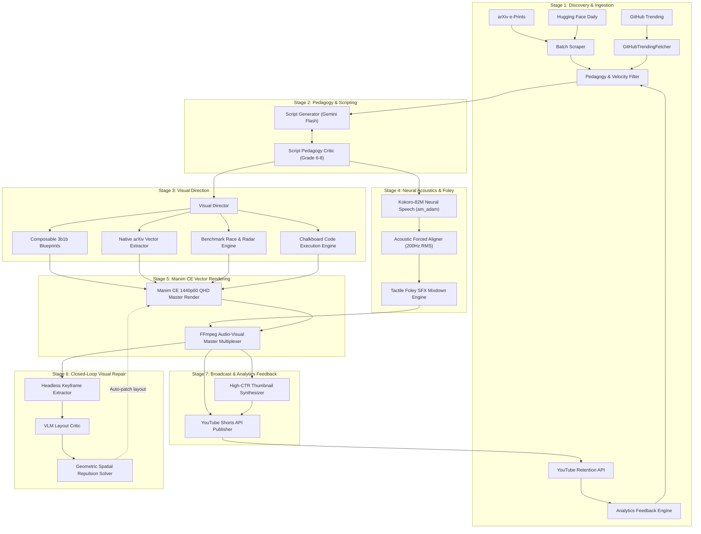

# 🏛️ ARCHITECTURE.md — The Model Verse System Architecture

> **The Model Verse Autonomous Video Production Engine**  
> End-to-end architecture specification for automated paper-to-video and code-to-video synthesis.

---

## 1. High-Level Architecture

The Model Verse converts cutting-edge research publications and open-source code repositories into broadcast-grade 3Blue1Brown vertical shorts (9:16 at 1440p60 QHD) through a modular 7-stage autonomous pipeline:



---

## 2. Pipeline Execution Stages

### Stage 1: Discovery & Ingestion
- **arXiv & Hugging Face (`pipeline/batch_digest.py`, `pipeline/arxiv_fetcher.py`)**: Fetches daily trending papers, cleans LaTeX abstracts, extracts publication metadata, and queries e-print source bundles.
- **GitHub Trending AI (`pipeline/github_trending_fetcher.py`)**: Scans viral repositories (`topic:llm`, `topic:cuda`, `stars:>1000`) and extracts core execution kernels (e.g. RadixAttention in SGLang, PagedAttention in vLLM, BitNet ternary GEMM).
- **Audience Velocity Calibration (`pipeline/analytics_feedback.py`)**: Multiplies candidate discovery scores by real-time YouTube audience retention velocity (e.g., `hardware_efficiency: 1.44x`, `multimodal_diffusion: 1.29x`).

### Stage 2: Pedagogy & Script Synthesis
- **Structured Script Specification (`pipeline/script_generator.py`)**: Prompts Gemini 2.5 Flash to synthesize a 6-beat voiceover script adhering to strict Subject-Verb-Object (`svo_action`) semantic triples, everyday physical analogies (e.g. sculptor, cloud, mirror, filing cabinet), and exact mathematical formula bindings.
- **Pedagogy Critic Gate (`pipeline/script_critic.py`)**: Autonomously audits the generated script against Flesch-Kincaid Grade Level ($\le 8.0$), reading ease ($\ge 65$), and anti-jargon constraints. If the score is below threshold, an autonomous rewrite loop refines beat sentences into simple, conversational language.

### Stage 3: Visual Direction & Blueprint Assignment
- **Visual Director (`pipeline/visual_director.py`)**: Analyzes spoken narrative and analogies to assign bespoke visual blueprints:
  - **Narrative Blueprints (`manim_engine/primitives/visual_compositions.py`)**: Pipeline stages, split flows, catalog routing, camera projective geometry, barrier isolation, decision trees, layer stacks, convergence funnels.
  - **Physics Simulations (`manim_engine/primitives/physics_simulations.py`)**: Vector flow fields, synaptic activation waves, attention prism optical refractions, 2.5D loss landscape gradient descents.
  - **Authentic arXiv Figures (`pipeline/arxiv_vector_extractor.py`)**: Extracts PDF/EPS vector graphics from arXiv LaTeX tarballs and recolors paths for the `#0A0D14` carbon chalkboard.
  - **Multi-Model Showdown (`manim_engine/primitives/showdown_engine.py`)**: Parses benchmark tables into animated Horizontal Race Bars and 5-axis Spider/Radar Pareto Frontier plots.
  - **Chalkboard Code Execution (`manim_engine/primitives/code_execution_engine.py`)**: Renders macOS window chrome, syntax tokenization (Python, CUDA, C++), active line scanning, and live GPU register monitors.

### Stage 4: Neural Acoustics & Tactile Foley Engine
- **Neural Speech (`pipeline/audio_synthesizer.py`)**: Kokoro-82M ONNX model (`am_adam` voice) rendered with dynamic pacing (1.12x speedup calibrated to YouTube retention).
- **Acoustic Forced Alignment (`pipeline/aligner.py`)**: 200 Hz (5ms hop) Savitzky-Golay smoothed RMS energy envelope tracking that snaps word boundaries to acoustic dips with $\pm 75\text{ms}$ precision. Enforces the **Frame-Ahead Rule** (-33ms to -66ms) so animation motion leads auditory perception.
- **Tactile Foley SFX Mixdown (`public/sfx/`)**: Automatically mixes subtle zero-license sound effects (sub-bass impacts, laser sweeps, camera whooshes, mechanical clicks, glass chimes) at the exact millisecond timestamps where visual primitives trigger.

### Stage 5: Manim CE Vector Rendering
- **Broadcast Render Specs**:
  - Resolution: $1440 \times 2560$ (2K QHD Vertical) or $1080 \times 1920$ (FHD Vertical)
  - Framerate: 60 FPS
  - Aspect Ratio: 9:16
  - Color Palette: 3Blue1Brown Carbon Chalkboard (`#0A0D14`), Neon Cyan (`#38BDF8`), Mint Green (`#10B981`), Amber (`#F59E0B`), Coral (`#EF4444`), Violet (`#C084FC`)
- **Continuous Micro-Motion**: Uses Manim updaters (`add_updater`, `ValueTracker`) to ensure zero static dead frames throughout the entire reel.

### Stage 6: Closed-Loop Visual Repair
- **VLM Keyframe Audit (`pipeline/vlm_critic.py`)**: Headless keyframes are analyzed by Gemini Vision to detect overlaps or off-screen elements.
- **Deterministic Geometric Layout Solver (`pipeline/geometric_layout_solver.py`)**: Converts VLM bounding boxes into coordinate adjustments and applies spatial repulsion forces to resolve collisions deterministically without hallucination.

### Stage 7: Broadcast & Autonomous Upload
- **High-CTR Thumbnails (`scripts/generate_thumbnail.py`)**: Renders a high-contrast visual hook with glowing hero geometry, 3b1b branding, and bold uppercase headline.
- **YouTube Shorts API (`pipeline/publisher.py`)**: Uploads via OAuth2 with optimized technical tags, SEO description, and audience engagement metadata.
- **Standing Daily Daemon (`pipeline/daily_shorts_daemon.py`)**: Background cron-like scheduler executing production across 5 global pre-peak upload slots (01:00, 05:00, 09:00, 12:00, 16:00 UTC).

---

## 3. Directory Layout & Key Modules

```
themodelverse-shorts/
├── AGENTS.md                          # Autonomous agent operating manual
├── ARCHITECTURE.md                    # System architecture specification (this file)
├── CHANGELOG.md                       # Comprehensive version changelog
├── CONTRIBUTING.md                    # Guidelines for contributors
├── README.md                          # Project overview and quickstart
├── requirements.txt                   # Python dependencies (manim, kokoro, pymupdf)
├── package.json                       # Node dependencies for Remotion & captions
│
├── pipeline/                          # Backend Production Pipeline
│   ├── daily_shorts_daemon.py         # Autonomous 5-slot daily production daemon
│   ├── auto_produce.py                # Single-command automated production orchestrator
│   ├── script_generator.py            # Gemini 2.5 Flash scriptwriter with SVO triples
│   ├── script_critic.py               # Grade 6-8 pedagogy auditor & auto-refiner
│   ├── visual_director.py             # Script-driven visual blueprint director
│   ├── benchmark_extractor.py         # LaTeX benchmark table parser
│   ├── github_trending_fetcher.py     # GitHub trending AI & kernel ingest engine
│   ├── arxiv_fetcher.py               # arXiv API and paper downloader
│   ├── arxiv_vector_extractor.py      # Native arXiv PDF/EPS vector figure extractor
│   ├── aligner.py                     # 200 Hz acoustic forced aligner (energy snapping)
│   ├── audio_synthesizer.py           # Kokoro TTS & Tactile Foley SFX mixdown
│   ├── analytics_feedback.py          # Real-time YouTube retention feedback loop
│   ├── publisher.py                   # YouTube Data API v3 publisher
│   ├── geometric_layout_solver.py     # Deterministic spatial repulsion collision solver
│   └── vlm_critic.py                  # Vision-Language keyframe auditor
│
├── manim_engine/                      # Manim Community Edition (CE v0.19+)
│   ├── primitives/
│   │   ├── visual_compositions.py     # Composable 3b1b visual blueprints
│   │   ├── physics_simulations.py     # Continuous micro-motion physics simulations
│   │   ├── showdown_engine.py         # Benchmark race bars & radar Pareto plots
│   │   ├── code_execution_engine.py   # Chalkboard code block & active line scanner
│   │   ├── typography.py              # Subpixel CleanText & formatting
│   │   ├── neural/                    # SAE, MoE, attention heatmaps, diffusion fields
│   │   ├── robotics/                  # Coupled C-space canvas, kinematics, AST trees
│   │   └── search/                    # Dynamic search trees, MCTS gauges, branch-and-bound
│   └── scenes/
│       └── dynamic_scene.py           # Universal VSG-driven composite scene
│
├── public/                            # Persistent Public Assets & SFX
│   ├── sfx/                           # Curated zero-license micro-SFX WAVs
│   ├── rendered_videos/               # Production master MP4 archives
│   ├── beat_svgs/                     # Synthesized vector SVGs
│   └── visual_assets/                 # Static branded graphics
│
└── test/                              # Pytest Automated Test Suite
    ├── test_github_trending_fetcher.py # Unit tests for GitHub trending engine
    ├── test_code_execution_engine.py   # Unit tests for code visualizer & safe zones
    ├── test_showdown_engine.py        # Unit tests for race bars & radar plots
    ├── test_analytics_alignment.py    # Unit tests for YouTube retention analytics
    ├── test_arxiv_figure_extraction.py # Unit tests for vector figure extractor
    ├── test_script_critic.py          # Unit tests for pedagogy & readability critic
    └── test_phase6_auto_repair.py     # Integration tests for VLM critic & layout solver
```
